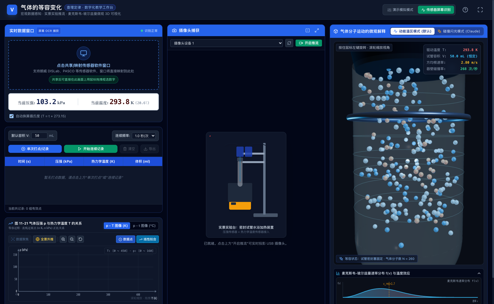
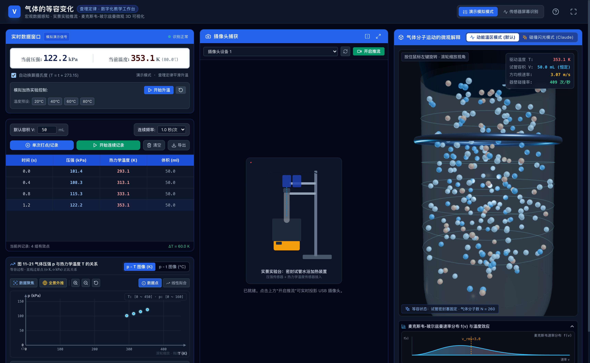
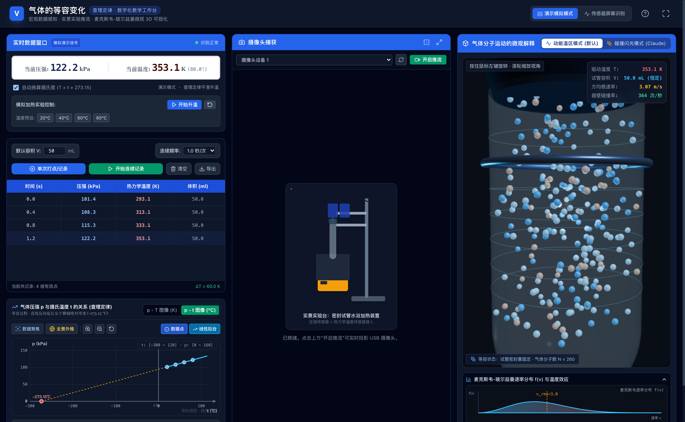
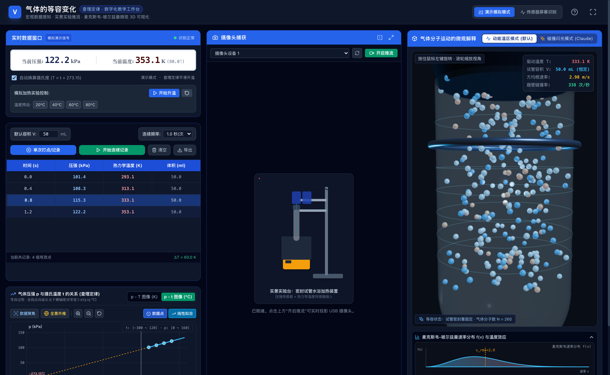
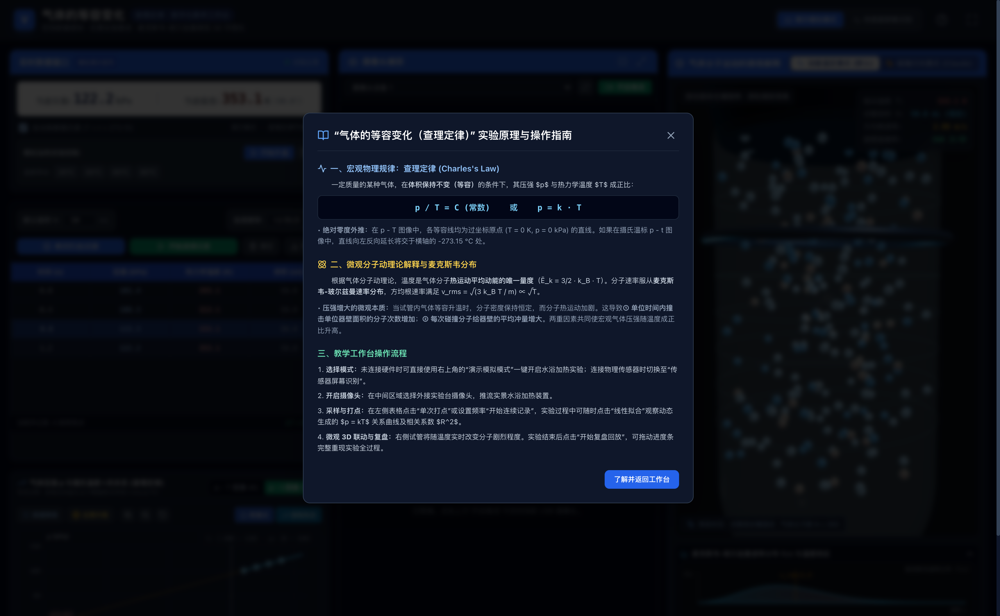
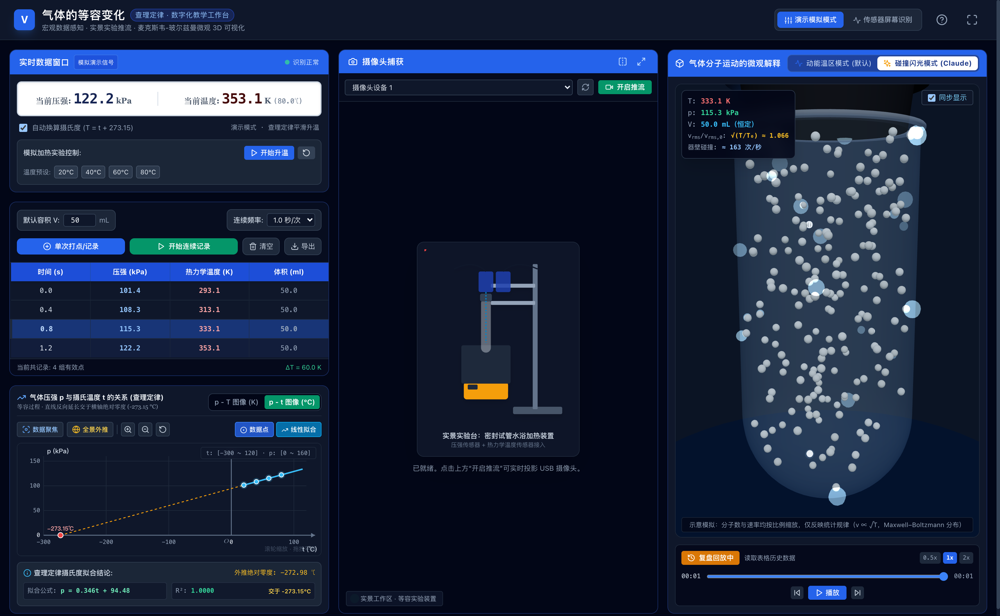
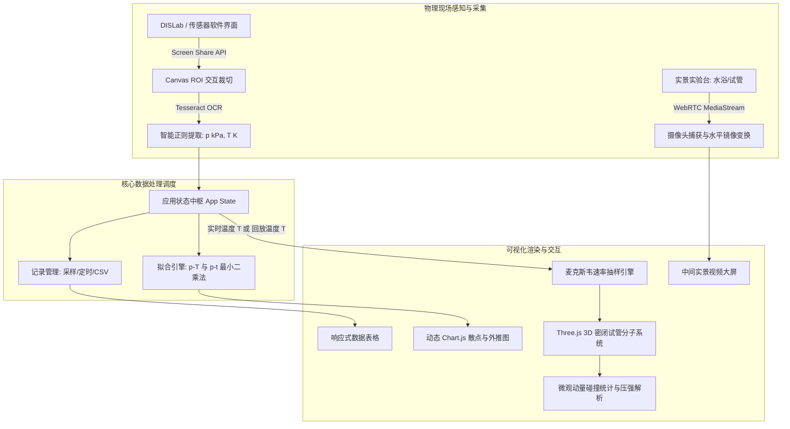

# 气体的等容变化（查理定律）- 数字化教学与微观 3D 可视化实验工作台
### Charles's Law Isochoric Lab: Digital Teaching & 3D Microscopic Molecular Workbench

[](https://www.typescriptlang.org/)
[](https://react.dev/)
[](https://threejs.org/)
[](https://vitejs.dev/)
[](https://tailwindcss.com/)
[](https://opensource.org/licenses/MIT)
[](https://en.wikipedia.org/wiki/Charles%27s_law)

---

## 📖 项目简介 (Project Overview)

**气体的等容变化（查理定律）数字化教学与微观 3D 可视化实验工作台** 是一套专为高中物理选择性必修三《热学·气体的等容变化》设计的现代化、全沉浸式数字化探究与教学软件。

工作台采用现代科学计算与微前端响应式三栏布局，将传统物理实验中**分离、割裂的教学要素**深度融合在同一个交互画布中：
1. **左侧：数据感知与图表分析系统** —— 屏幕共享窗口互动框选 ROI，利用智能 OCR 实时提取物理传感器（DISLab / 朗威 / 远大等实验软件）的压强 $p$ 与温度 $T$，提供高精度数据打点、连续采样、CSV 导出，以及 $p - T$（热力学温标）与 $p - t$（摄氏温标）动态拟合和绝对零度外推。
2. **中间：实景实验摄像头流媒体中心** —— 基于 WebRTC 多媒体流管理，实时捕获实验台实物（水浴加热装置、密封试管、压力传感器、温度传感器），支持水平镜像反转与大屏全屏沉浸式投影。
3. **右侧：微观分子热运动 3D 虚拟仿真** —— 严格遵循**麦克斯韦-玻尔兹曼速率分布（Maxwell-Boltzmann Distribution）**与完全弹性碰撞动力学，将实时采集到的宏观温度映射为微观分子动能，实时展现气体分子撞击器壁频率与动量变化，从分子动理论微观本质解释气体压强升高的物理根源，并支持与采集数据的全流程**历史复盘与时间轴联动**。

---

## 🎯 开发背景与解决的教学痛点 (Motivation & Pain Points)

在传统高中物理课堂中，“气体的等容变化（查理定律 $p \propto T$）”往往面临如下教学难点：

* ❌ **实验软件割裂，数据无法贯通**：市面上 DIS / 朗威等物理传感器软件大多为封闭的 Windows 客户端，其图表和数值只能在其独立窗口显示，无法与教学课件或 3D 仿真模型联动。
* ❌ **“只知公式，不知本质”的认知鸿沟**：学生能够记住 $p_1 / T_1 = p_2 / T_2$，但往往无法在脑海中建立微观图像，不理解为什么“温度升高、体积不变时，气体压强会成正比增大”。
* ❌ **绝对零度外推缺乏动态直观性**：在 $p - t$ 图像中，从室温和沸水温区（$0 \sim 100^\circ\text{C}$）向左反向外推至压强为零的“绝对零度点（$-273.15^\circ\text{C}$）”，黑板板书难以精确呈现外推虚线与真实数据的几何关系。
* ❌ **课堂演示视角受限**：后排学生看不清真实的试管膨胀与水银/密封塞状态；实验记录手工誊写慢、容易出错。

本项目通过 **“屏幕视觉识别感知 + 实景摄像导播 + 麦克斯韦热运动微观 3D 建模 + 动态坐标系”** 的四位一体架构，彻底打通了高中物理热学实验的“宏观现象 - 实验数据 - 微观本质 - 数学规律”。

---

## 📸 运行界面与实测截图 (Screenshots Tour)

### 1. 三栏响应式实验工作台全景 (Workbench Overview)
左侧传感器实时监控与数据记录、中间实景加热与测温摄像头推流、右侧三维密闭试管麦克斯韦分子运动仿真，界面层次清晰，专为课堂多媒体一体机与教学投影优化设计。



---

### 2. $p - T$ 散点动态采集与一键最小二乘法线性拟合 (Linear Regression)
连续采样水浴升温过程中的 $(p, T)$ 散点，一键生成过原点的最佳拟合直线 $p = kT$，自动计算判定系数 $R^2 = 1.0000$，右侧实时呈现微观分子平均碰撞频率与冲量统计。



---

### 3. $p - t$ 摄氏度温标切换与绝对零度反向外推 (Celsius Extrapolation)
无缝切换至摄氏度 $p - t$ 模式，动态坐标系支持自由缩放平移，拟合直线 $p = kt + p_0$ 自动反向外推虚线，精准相交于横轴绝对零度点（$-273.15^\circ\text{C}$）。



---

### 4. 实验数据复盘联动与微观分子动力学 (Replay & Dynamics)
暂停实时推流后可拖动历史数据滑块，3D 试管分子动能、温度读数、表格高亮行及散点图指示游标全维同步回放，方便课后细致推导与小组讨论。



---

### 5. 课堂教学与实验原理指导弹窗 (Teaching Guide Modal)
内置查理定律数学模型推导、麦克斯韦速率分布统计力学解释及规范实验步骤指南，教师一键调出即可展开理论铺垫。



---

### 6. 双模式微观仿真切换：Claude 碰撞微闪光效果 (Collision Flash Mode)
在工作台右上方提供一键模式切换选项卡。切换至“碰撞闪光模式 (Claude)”后，试管采用半球圆底结构与阴影底盘，粒子撞击器壁时触发能量缩放的加色微闪光（Sparkles），并配备沉浸式 HUD 与同步待机遮罩。



---

## ✨ 核心系统特性 (Key Features)

### 📊 模块 A：左侧——数据感知与图表分析系统
1. **互动式屏幕共享与 ROI 划选**：
   - 支持调用浏览器原生 Screen Capture API 共享任意传感器软件窗口或屏幕。
   - 画面实时映射在左上角画布中，支持鼠标拖拽自由绘制红色矩形选区（ROI），杜绝像素偏移。
   - 实时提供 240×70 的裁切放大镜预览与 OCR 原文及置信度反馈。
2. **工业级 DIS OCR 鲁棒提取引擎**：
   - 采用轻量化本地 Tesseract OCR 引擎。
   - 内置针对国产实验软件（朗威、远大等）的特殊数字/中文字符纠错算法，精准过滤中文标签（如“压强:”、“温度:”、“S188:”、“℃”）混淆的数字噪点，通过单位正则锚定抽取压强（$\text{kPa}$）与温度（$\text{K}$）。
3. **数字化实验表格管理**：
   - 设定默认气室容积（默认 $50.0\ \text{mL}$）。
   - 支持**单次打点采样**与**定时连续记录**（支持 0.5s、1.0s、2.0s 周期自适应切换）。
   - 表格支持独立内部滚动、最新行自动平滑聚焦、一键数据重置（防误触二次确认）与标准 CSV 格式导出。
4. **双温标动态图表与数学拟合**：
   - **$p - T$（热力学温标模式）**：横轴 $0 \sim 450\ \text{K}$，一键过原点最小二乘法拟合 $p = kT$，计算 $R^2$。
   - **$p - t$（摄氏温标模式）**：横轴 $-300 \sim 150\ ^\circ\text{C}$，一键线性拟合 $p = kt + p_0$，自动计算横轴截距 $t_0 = -p_0 / k$，图形化绘制红蓝渐变虚线外推至绝对零度（$-273.15^\circ\text{C}$）。
   - **视口自适应缩放与步长计算**：支持滚轮缩放、鼠标拖拽平移、一键“适配合适视野”及坐标原点重置。

---

### 🎥 模块 B：中间——实景实验摄像头流媒体中心
1. **多外接设备热插拔与枚举**：
   - 采用 WebRTC `navigator.mediaDevices.enumerateDevices()` 自动监听并罗列系统接入的所有视频采集设备（内置高清摄像头、外接 USB 显微/微距摄像头、采集卡等）。
2. **高画质低延迟推流与导播控制**：
   - 1080p / 60fps 实时硬件加速渲染，带有 FPS 帧率监控与推流状态指示。
   - 提供**水平镜像反转**开关，解决投影仪和前置摄像头左右翻转难题。
   - 提供**一键全屏演示**模式，方便大屏课堂投影展示试管内部微小变化。

---

### 🔬 模块 C：右侧——微观分子热运动 3D 虚拟仿真
1. **基于物理规律的麦克斯韦-玻尔兹曼速率分布**：
   - 严格杜绝随意乱动的假动画，程序采用 Box-Muller 变换与极坐标离散采样，生成三维速度向量：
     $$f(v) = 4\pi \left(\frac{m}{2\pi k_B T}\right)^{3/2} v^2 \exp\left(-\frac{m v^2}{2 k_B T}\right)$$
     方均根速率严格满足：$v_{\text{rms}} = \sqrt{\frac{3 k_B T}{m}} \propto \sqrt{T}$。
2. **支持双模式微观解释随心切换 (Dual Simulation Modes)**：
   - **模式一：动能温区模式（默认）**：
     * 260 个硬球分子依据实时速率动态映射热力学色彩：冷蓝（慢速） $\to$ 青白（平均） $\to$ 暖橙红（高能）；
     * 包含高质感刻度线装饰与外壁固定支架，底部提供展开式**麦克斯韦速率分布 $f(v)$ 理论曲线图**。
   - **模式二：碰撞闪光模式（参考 Claude 版）**：
     * 半球圆底透明试管 + 底部圆形阴影参照底盘；
     * **器壁碰撞微闪光粒子池（Collision Sparkles）**：分子撞击管壁和圆底时产生与冲量成正比的加色小光斑，随时间指数级平滑衰减，视觉冲击力强；
     * 叠加沉浸式极简 HUD 看板（$T, p, V, v_{\text{rms}}/v_{\text{rms},0}$、碰撞频率）与同步/待机模式切换。
3. **宏观压强的微观统计诠释**：
   - 实时计算所有分子对器壁碰撞的累计动量冲量 $\Delta P$，除以时间步长 $\Delta t$ 与容器内表面积 $S$，得出微观统计压强，实时印证压强升高的本质是**分子碰撞频率增加与平均冲量增大**。
4. **历史数据点复盘回放（Replay Mode）**：
   - 可随心在“实时同步”与“数据回放”之间切换。回放模式下，分子热运动动能、温度计读数、数据行光标与拟合图表指示线完全同步步进，**两套微观模式均完美支持时间轴拖动回放**。

---

## 🔄 双版本共存与版本回退指南 (Version & Mode Rollback)

为满足不同教学风格需求与版本控制要求，本项目提供了两种层面的灵活回退与选择方案：

### 1. 界面一键即时切换（零技术门槛）
在工作台右上方标题栏即可直接点击：
- 点击 **「动能温区模式 (默认)」**：即刻回到初始发布版本的微观解释视图（三色温区粒子、刻度管壁与麦克斯韦分布展开图）；
- 点击 **「碰撞闪光模式 (Claude)」**：即刻体验圆底试管与器壁撞击微闪光特效；
- 用户的选择将自动保存在浏览器本地缓存中，刷新后依然保持。

### 2. Git 版本控制完整回退（源码级绝对复原）
本项目已在 Git 仓库中为初始发布版本打上了发布标签 `v1.0.0`：
```bash
# 查看所有可用版本标签
git tag -l

# 一键切换/检出至纯净初始版本 (v1.0.0)
git checkout v1.0.0

# 随时重新切回最新双模式分支
git checkout main
```

---

## 🏗️ 系统架构与数据流动 (Architecture & Dataflow)



---

## 🛠️ 技术栈 (Technology Stack)

| 领域 | 技术选型 | 说明 |
| :--- | :--- | :--- |
| **前端核心** | React 18 + TypeScript 5.4 | 组件化状态驱动、高类型安全性 |
| **样式与布局** | Tailwind CSS + Lucide React | 现代化暗色系实验室界面、响应式三栏栅格 |
| **3D 物理渲染** | Three.js (r162) | WebGL 硬件加速、玻璃拟物材质、微观分子粒子群 |
| **数据图表** | Chart.js 4.4 + React-Chartjs-2 | 散点图、拟合直线、坐标轴动态刻度步长与平移缩放 |
| **计算机视觉** | Tesseract.js 5.0 + Canvas 2D | 客户端浏览器轻量 OCR、ROI 像素映射与预处理 |
| **音视频多媒体**| WebRTC MediaDevices API | 摄像头热拔插设备枚举、超低延迟流媒体渲染 |
| **构建工具** | Vite 5.4 + PostCSS | 秒级 HMR 模块热更新、生产环境 Tree-shaking 打包 |
| **测试与验证** | Node.js ESM 原生测试套件 | 验证麦克斯韦采样方差、线性拟合算法、绝对零度外推 |

---

## 📁 项目目录结构 (Directory Structure)

```text
charles-law-isochoric-lab/
├── docs/                           # 详细文档与说明资源
│   ├── architecture.md             # 深度技术架构与物理原理剖析
│   └── images/                     # 真实高清界面与功能运行截图
│       ├── 01-workbench-overview.png
│       ├── 02-pt-linear-regression.png
│       ├── 03-celsius-absolute-zero.png
│       ├── 04-replay-and-molecular-dynamics.png
│       └── 05-experiment-guide-modal.png
├── public/                         # 静态静态资源
│   └── favicon.svg                 # 矢量分子与压力表实验室图标
├── scripts/                        # 自动化脚本与测试套件
│   ├── captureScreenshots.mjs      # 基于 CDP 的无头浏览器高保真截图脚本
│   └── verifyPhysics.mjs           # 物理拟合与麦克斯韦分布自动化单测
├── src/                            # 源代码根目录
│   ├── components/                 # 界面功能组件
│   │   ├── CenterPanel/            # 中间栏：实景摄像头流媒体组件
│   │   │   └── CameraFeed.tsx
│   │   ├── LeftPanel/              # 左侧栏：数据感知、表格与图表
│   │   │   ├── DataTable.tsx       # 实验数据表格与 CSV 导出
│   │   │   ├── PTChart.tsx         # p-T / p-t 散点、线性拟合与外推图表
│   │   │   └── ScreenCaptureCard.tsx # 屏幕共享、ROI 选区与 OCR 识别卡片
│   │   ├── RightPanel/             # 右侧栏：微观 3D 分子动力学与复盘
│   │   │   ├── MicroscopicStats.tsx# 微观分子平均动能与碰撞冲量统计
│   │   │   └── ReplayControls.tsx  # 历史数据轨迹复盘控制条
│   │   ├── Header.tsx              # 顶部导航栏与状态指示
│   │   └── HelpModal.tsx           # 实验原理与查理定律教学指导弹窗
│   ├── sensors/                    # 传感器与外部数据输入抽象层
│   │   ├── cameraManager.ts        # 摄像头设备枚举与媒体流生命周期管理
│   │   ├── mockDataGenerator.ts    # 课堂演示用仿真传感器数据发生器
│   │   ├── ocrRecognizer.ts        # Tesseract OCR 调度与高精度正则清洗
│   │   └── screenCapture.ts        # 屏幕捕获与坐标变换工具
│   ├── simulation/                 # 物理仿真与 3D 动力学核心
│   │   ├── maxwellBoltzmann.ts     # 麦克斯韦-玻尔兹曼分布采样与物理常数
│   │   ├── molecularSystem.ts      # 200 分子弹性碰撞与三维动量更新
│   │   └── TubeScene.tsx           # Three.js 玻璃试管与粒子渲染场景
│   ├── types/                      # TypeScript 类型定义
│   │   └── physics.ts              # 实验点、拟合结果、设备状态数据契约
│   ├── utils/                      # 数学与工具函数
│   │   ├── exportData.ts           # CSV 格式化与下载流处理
│   │   └── mathFitting.ts          # 最小二乘法线性回归与刻度步长计算
│   ├── App.tsx                     # 顶层状态调度与联动中枢
│   ├── index.css                   # 全局样式与 Tailwind 指令
│   └── main.tsx                    # React 入口挂载
├── index.html                      # 单页面 HTML 模板
├── package.json                    # 项目元信息与依赖配置
├── tsconfig.json                   # TypeScript 编译选项
└── vite.config.ts                  # Vite 打包配置
```

---

## 🚀 快速上手与运行 (Getting Started)

### 1. 环境准备 (Prerequisites)
- **Node.js**: `v18.0.0` 或更高版本（推荐 `v20.x` / `v22.x` LTS）。
- **包管理器**: `npm`（建议 `v9.0.0+`）或 `pnpm`。
- **现代化浏览器**: Chrome 100+、Edge 100+、Firefox 110+ 或 Safari 16+（需支持 WebGL、WebRTC 及 Screen Capture API）。

### 2. 本地安装与启动 (Installation & Run)

```bash
# 1. 克隆代码仓库
git clone https://github.com/WUHAO19831214/charles-law-isochoric-lab.git
cd charles-law-isochoric-lab

# 2. 安装项目依赖
npm install

# 3. 运行自动化物理计算与算法单元测试
npm test

# 4. 启动本地开发服务器
npm run dev
```

启动成功后，浏览器访问终端提示的本地地址（默认 `http://localhost:5173`）即可进入工作台。

### 3. 项目构建 (Production Build)

```bash
# 执行类型检查与生产环境打包
npm run build

# 本地预览生产构建产物
npm run preview
```
打包产物将输出在 `dist/` 目录下，可直接部署至任何静态托管服务（Vercel、Netlify、GitHub Pages、Nginx）。

---

## 🧑‍🏫 典型课堂教学实验流程 (Typical Teaching Workflow)

在讲授《气体的等容变化（查理定律）》一节课时，建议教师按以下步骤开展教学：

1. **情境导入与设备联调**：
   - 打开工作台，在中间选择**外接实景摄像头**，对准铁架台上的烧杯水浴装置与密封试管；
   - 点击左上角“共享屏幕”，选择投影仪副屏或电脑上运行的朗威/DISLab传感器软件窗口；
   - 在左上角画面中**用鼠标框选数字读数区域**，工作台即刻开始以毫秒级频率实时识别压强 $p\ (\text{kPa})$ 与温度 $T\ (\text{K})$。
2. **水浴加热与动态采样**：
   - 点燃酒精灯对水浴缓慢加热，气温从室温（约 $293\ \text{K}$）逐渐攀升；
   - 教师可点击“单次记录”在代表性温度点（如 300K, 310K, 320K...）采样，或点击“开始连续记录”以 1s 间隔自动生成数据序列。
3. **宏观测量与微观动力学实时对照**：
   - 观察右侧 3D 试管：随着左侧温度数值上升，试管内分子颜色逐渐由冷蓝向暖红转变，运动速度肉眼可见地变快；
   - 引导学生观察底部的“碰撞冲量统计”与“器壁碰撞频率”，理解**温度升高使分子平均动能增加，单位时间内撞击试管壁的冲量增大，宏观上表现为压强增大**。
4. **数学建模与定律归纳**：
   - 点击图表下方的“一键线性拟合”，系统自动绘制 $p = kT$ 拟合直线，并在标题栏输出 $R^2 \approx 0.9999$；
   - 切换至“$p - t$（摄氏度）”模式，缩放坐标系观察直线反向外推虚线精准交于横轴的 $-273.15^\circ\text{C}$，顺理成章引入**绝对零度**与**热力学温标**概念。
5. **数据复盘与实验报告导出**：
   - 实验结束后，关闭实时同步，拖动“复盘回放”进度条带领学生逐点回顾升温全过程；
   - 点击“导出 CSV”，将整堂课收集的真实实验数据分发给学生课后撰写探究报告。

---

## 🔬 物理与数学核心原理 (Scientific Principles)

### 1. 查理定律（Charles's Law）
一定质量的某种理想气体，在体积保持不变的条件下，其压强 $p$ 与热力学温度 $T$ 成正比：
$$\frac{p}{T} = C \quad \Longleftrightarrow \quad p = kT$$
在摄氏温标下，压强与摄氏温度 $t$ 的关系为：
$$p_t = p_0 (1 + \alpha t) = p_0 \left(1 + \frac{t}{273.15}\right) = \frac{p_0}{273.15} (t + 273.15)$$
当外推至 $p_t = 0$ 时，理论截距恰好为绝对零度 $t = -273.15^\circ\text{C}$。

### 2. 麦克斯韦-玻尔兹曼速率分布（Maxwell-Boltzmann Distribution）
在理想气体三维平衡态下，速率在 $v \sim v + dv$ 区间内的分子概率密度为：
$$f(v) = 4\pi \left(\frac{m}{2\pi k_B T}\right)^{3/2} v^2 \exp\left(-\frac{m v^2}{2 k_B T}\right)$$
气体的平均平动动能 $\bar{E}_k$ 与方均根速率 $v_{\text{rms}}$ 分别为：
$$\bar{E}_k = \frac{3}{2} k_B T, \qquad v_{\text{rms}} = \sqrt{\frac{3 k_B T}{m}}$$
在模拟器中，当温度 $T$ 发生改变时，分子群的速度向量按 $\sqrt{T_{\text{new}} / T_{\text{old}}}$ 严格等比例放缩，确保微观粒子完全符合热力学统计规律。

---

## ⚠️ 已知限制与使用说明 (Limitations & Notes)

1. **浏览器权限要求**：
   - 屏幕共享与摄像头推流依赖浏览器的安全上下文（HTTPS 或 `localhost`）。首次使用需允许摄像头与屏幕录制授权。
2. **OCR 识别准确度**：
   - 本项目内置了高抗干扰的正规清洗算法，但仍建议教师在框选 ROI 区域时**仅框选清晰可见的数字与单位字符**，避免框选过大包含背景图表曲线或无关文字。
3. **3D 粒子性能**：
   - 默认分子数量设定为 200 个，在主流核心显卡或核显笔记本上均能以 60 FPS 稳定流畅渲染；如需更密集的分子群，可在 `src/simulation/molecularSystem.ts` 中调整 `MOLECULE_COUNT`。

---

## 🗺️ 后续迭代路线 (Roadmap)

- [ ] **微观速率分布直方图联动**：在右侧 3D 试管下方增加实时的 $f(v) - v$ 麦克斯韦理论曲线与当前分子抽样直方图叠加对照。
- [ ] **WebAssembly SIMD 动力学加速**：支持 1000+ 分子的高性能分子间相互碰撞（Lennard-Jones 势能）实时计算。
- [ ] **局域网多端同步广播**：利用 WebSocket / WebRTC DataChannel 将教师端实时实验数据与 3D 画面一键推送至教室学生平板。

---

## 📄 开源许可证 (License)

本项目采用 [MIT 许可证](LICENSE) 开源。欢迎各类物理教研室、中学物理教师与开源爱好者自由使用、修改与衍生教学。

---

## 🤝 贡献与致谢 (Acknowledgements)

- 感谢开源三维引擎 [Three.js](https://threejs.org/) 提供优秀的 WebGL 渲染支持。
- 感谢 [Tesseract.js](https://github.com/naptha/tesseract.js) 团队在客户端纯 JavaScript OCR 领域的开源工作。
- 感谢一线高中物理教师在数字化实验教学交互与视觉设计上提出的宝贵建议。
